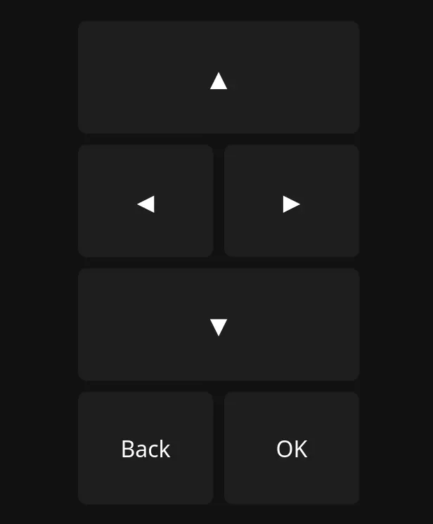

# Python Web Remote Control API

Made this to control a streaming box that was running Arch and needed to use the arrow keys to move around the UI on the TV.



## Installation

### Bare metal

Make a venv and then install the package into that venv.

```bash
python -m venv venv
source venv/bin/activate
pip install .
```

### Docker

Edit the docker compose file and then compose up.

```bash
docker compose up -d
```

## Usage

To run the program just call it from the terminal

```bash
web-tv-remote-control
```

Then you can access it on port 8080 of the machine you are running it on.
