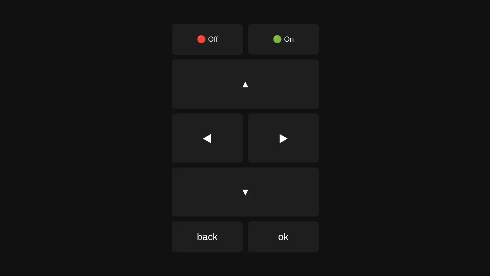

# 📺 Web TV Remote Control

A lightweight web-based remote control for TV/streaming boxes. Built to control a Linux streaming box where the on-screen UI needed to be navigated with arrow keys.



## Features

- Control a device's UI (arrow key navigation, etc.) from any browser on your network
- Simple installation via `pip` or Docker
- Runs a lightweight web server on port `8080`
- Two deployment modes (`api` and `controller`) for turn off and on features (not possible with default mode)

## Requirements

- Python 3.x
- `pip` and `venv` (for bare metal installation)
- Docker and Docker Compose (for containerized installation)

## Modes

This app runs in one of three modes, set via `MODE` (env var) or `--mode` (CLI flag):

| Mode | What it does |
|---|---|
| `api` | Runs the web server and presses keys locally on this box (needs `/dev/uinput`). No SSH/config dir required. |
| `controller` | Talks to a remote `api` instance over HTTP, and additionally handles power-on (Wake-on-LAN) and power-off (SSH) for that remote box. Requires a config dir with an SSH keypair. |
| `both` | Runs `api` and `controller` logic in the same process/container for a single-box setup. No config dir required (no remote SSH target). |

If you're running everything on one machine, use `both` (the default). If you're wanting the turn off and on logic, run `api` on the box and `controller` wherever you want to trigger it from.

## Installation

### Bare metal

Create a virtual environment and install the package into it:

```bash
python -m venv venv
source venv/bin/activate
pip install .
```

### Docker

Edit `docker-compose.yml` to suit your setup (see [Environment variables](#environment-variables) below for which vars apply to which mode), then bring up the container:

```bash
docker compose up -d
```

## Usage

Run the program from the terminal:

```bash
web-tv-remote-control
```

Once running, open a browser and navigate to port `8080` on the host machine:

```
http://<host-ip>:8080
```

## Docs

### Environment variables

Every CLI flag has a matching environment variable (`--flag-name` → `FLAG_NAME`). Env vars are used as the default when the CLI flag isn't passed.

| Variable | CLI flag | Required for | Description |
|---|---|---|---|
| `HOST` | `-H` or `--host` | all modes | Host/interface to listen on. Defaults to `::` |
| `PORT` | `-p` or `--port` | all modes | Port to listen on. Defaults to `8080` |
| `MODE` | `-m` or `--mode` | | `api`, `controller`, or `both`. Defaults to `both` |
| `API_TOKEN` | `--api-token` | `api`, `controller` | Bearer token for API auth. If unset in `api` mode, a temporary one is generated and printed to the log on startup |
| `CONFIG_DIR` | `--config-dir` | `controller` only | Directory containing `id_ed25519` (private key) and `known_hosts` - see [Config dir & SSH key setup](#config-dir--ssh-key-setup) |
| `API_URL` | `--api-url` | `controller` | Scheme + host + port of the remote `api` instance, e.g. `http://api.domain.tld:8080` |
| `API_MACADDRESS` | `--api-macaddress` | `controller` | MAC address of the remote box, used for wake-on-lan for "on" button |
| `SSH_USER` | `--ssh-user` | `controller` | SSH user on the remote box, used to trigger poweroff on "off" |
| `SSH_HOST` | `--ssh-host` | `controller` | SSH host/address of the remote box |
| `SSH_PORT` | `--ssh-port` | `controller` | SSH port of the remote box. Defaults to `22` |
| `PUID` | | Docker only | UID the process runs as inside the container |
| `PGID` | | Docker only | GID the process runs as inside the container |

`api` mode ignores controller-only vars if they're set (and warns about it). `both` mode does the same, it doesn't need `CONFIG_DIR` or the SSH/API fields, since there's no *remote* box to SSH into.

### Config dir & SSH key setup

`controller` mode uses a dedicated, restricted SSH key to power off the remote box, it does **not** use your normal SSH keys or `~/.ssh`. Set this up once per `controller` deployment.

**1. Generate the config dir and keypair**

```bash
mkdir config
ssh-keygen -t ed25519 -f config/id_ed25519 -N ""
cat config/id_ed25519.pub
```

**2. Paste the public key into `~/.ssh/authorized_keys` on the remote (API) box**, prefixed with a forced command so this key can *only* run `poweroff`

```
command="/usr/sbin/poweroff",no-port-forwarding,no-X11-forwarding,no-agent-forwarding,no-pty ssh-ed25519 AAAA...your-pubkey-here...
```

**3. Connect once to populate `known_hosts`**

```bash
ssh -i config/id_ed25519 -o UserKnownHostsFile=config/known_hosts -o StrictHostKeyChecking=accept-new user@host
```

**4. Set the permissions (the container won't do this by design to support :ro mounting)**

```bash
chmod 700 config
chmod 600 config/{known_hosts,id_ed25519}
```

You should now have:

```
config/
├── id_ed25519       # private key, keep this secret
├── id_ed25519.pub
└── known_hosts      # pinned host key for the remote box
```

Point `--config-dir` / `CONFIG_DIR` at this directory (or mount it to `/config` in Docker — see below).

### Docker Compose

```yaml
services:
  web-tv-remote-control:
    container_name: web-tv-remote-control
    ## needed for controller mode
    # network_mode: host
    build:
      context: .
      dockerfile: Dockerfile
    ## devices are only needed if you are running both or api mode
    devices:
      - /dev/uinput:/dev/uinput
    ports:
      - '8080:8080'
    environment:
      - HOST=0.0.0.0
      - PORT=8080
      - PUID=1000
      - PGID=1000
      ## remove these sections depending on (api|controller)
      ## api mode
      # - MODE=api
      # - API_TOKEN=secret # generated into the docker log on run once in api mode
      ## controller mode
      # - MODE=controller
      # - API_TOKEN=secret # get this from api container
      # - API_URL=https://api.domain.tld
      # - API_MACADDRESS=xx:xx:xx:xx:xx:xx
      # - SSH_USER=user
      # - SSH_HOST=api.domain.tld
      # - SSH_PORT=22
    volumes:
      ## needed for controller mode
      # - ./config:/config:ro
      - /etc/localtime:/etc/localtime:ro
    restart: unless-stopped
```

`controller` mode mounts `./config` (the dir from [Config dir & SSH key setup](#config-dir--ssh-key-setup)) to `/config` read-only, since the app only ever reads the key/known_hosts, never writes to them. `api`/`both` mode don't need this volume at all.

## Contributing

Issues/Features and pull requests are welcome!
